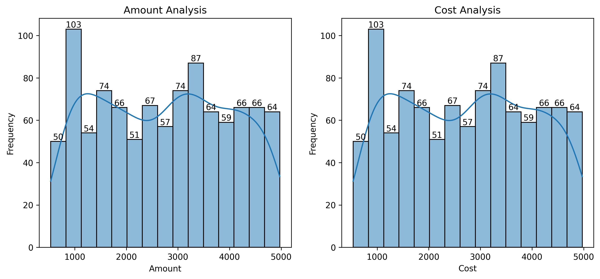

# Hospital_Revenue_Analysis-Python

## 1. Project Overview
The objective of this project is to leverage a simulated Hospital Management Dataset to gain critical insights into its operational efficiency, specifically targeting revenue generation and cost management. This initial phase focuses on understanding the financial landscape of the hospital, identifying key revenue streams, and pinpointing any discrepancies or inefficiencies that could impact profitability. The analysis utilizes various data manipulation, aggregation, and visualization techniques to present a clear picture of the hospital's financial performance.

## 2. Data Source
https://www.kaggle.com/datasets/kanakbaghel/hospital-management-dataset

## 3. Data Understanding and Preparation
The datasets used for this analysis is a Hospital Management Dataset sourced from Kaggle which have 5 csv files, those are:
**1. appointments.csv** : Patient appointment details.
**2. billing.csv** : Financial transaction records.
**3. doctors.csv** : Doctor demographic and specialization information.
**4. patients.csv** : Patient demographic data.
**5. treatments.csv** : Details regarding medical treatments provided.

**Initial Data Inspection:**
Each dataset was inspected for its structure, data types, and potential missing values or duplicates using `.info()`, `.head()`, `.describe()`, and `.isnull().sum()`. It was confirmed that the raw datasets were clean, with no significant missing values or duplicate entries requiring extensive pre-processing.

**Data Cleaning and Transformation:**
* The `appointment_date` column in appointments dataset, `bill_date` column in the `billing` dataset, `date_of_birth`,`registration_date` from pateints dataset, `treatment_date` column from treatments datset was successfully converted to a `datetime` object to facilitate time-series analysis.
* The `first_name` and `last_name` columns are combined and created a column named `doctor_name` in the `doctors` DataFrame and the columns `specialization`, `phone_number`, `years_experience`, `hospital_branch` were renamed to `dr_specialization`, `dr_phone_number`, `dr_years_experience`, `dr_hospital_branch` for clarity during merging to avoid conflicts with patient contact details and `first_name` and `last_name` columns were deleted.
* The `first_name` and `last_name` columns are combined and created a column named `patient_name` in the `doctors` DataFrame for clarity during merging to avoid conflicts during merging.

**Data Merging Strategy:**
* To enable a comprehensive analysis, all five datasets were systematically merged into a single DataFrame, named `merged_df`. This consolidation was crucial to link financial records (`billing`, `treatments`) with patient demographics (`patients`), doctor specializations (`doctors`), and appointment details (`appointments`).
* The merging was performed using appropriate common identifiers (e.g., `patient_id`, `doctor_id`, `appointment_id`, `treatment_id`) to ensure accurate data integration.
* A new dataset `df` created will all the required columns `appointment_id`, `appointment_date`, `appointment_time`, `gender`, `registration_date`, `patient_name`, `doctor_name`, `dr_specialization`, `dr_hospital_branch`, `treatment_type`, `cost`, `treatment_date`, `bill_date`, `amount`, `payment_method`, `payment_status`.
* The resulting `df` DataFrame provides a unified view for holistic analysis.

## 4. Exploratory Data Analysis (EDA) & Revenue Insights

### 4.1. Distribution of Billing Amount and Treatment Cost

An initial examination of the `amount` (billing) and `cost` (treatment) distributions provided a foundational understanding of the financial transactions.

* **Billing Amount:**
    * Min: 534.03
    * Max: 4973.63
    * Mean: 2742.80
    * Std Dev: 1280.62
* **Treatment Cost:**
    * Min: 534.03
    * Max: 4973.63
    * Mean: 2742.80
    * Std Dev: 1280.62
  
### 4.2. Payment Methods and Statuses

Understanding how payments are made and their current status is vital for revenue collection optimization.

* **Payment Methods:** The payment methods Credit Card **37.9%**, Insurance **31.7%** and Cash **30.3%**, indicating the channels for revenue inflow.
    [Insert Plot: Count/Proportion of Payment Methods]
* **Payment Statuses:** A significant proportion of payments were 'Paid' **35%**, but a notable percentage were 'Pending' **31.7%** and 'Failed' **33.2%** . This highlights potential challenges in the collection process that warrant further investigation.
    [Insert Plot: Count/Proportion of Payment Statuses]

### 4.3. Revenue by Gender

Analysis of total revenue categorized by patient gender are Male **1827242.30** and Female **921047.86**

[Insert Plot: Revenue by Gender]

### 4.4. Revenue by Doctor

Investigating revenue generation across different doctor helps identify high-value medical services and specialist contributions.
* 'Sarah Taylor', 'Alex Davis', 'David Taylor' were identified as the highest revenue-generating doctors.

[Insert Plot: Revenue by Doctors]

### 4.5. Revenue by Treatment Type

A detailed breakdown of revenue by `treatment_type` provides insights into the profitability and demand for specific services.
* 'Chemotherapy', 'X-Ray' and 'MRI' have the leading revenue contributon.
* Further analysis might be needed for treatment types showing high standard deviation in billing amounts, indicating potential discrepancies in pricing or service complexity (as explored in previous discussions).

[Insert Plot: Revenue by Treatment Type]

## Technologies Used
**Python**
**Pandas**
**NumPy**
**Matplotlib**
**Seaborn**
**Jupyter Notebook**

## Conclusion
By analysing this Hospital data,.................................................

## Author - BB Siva Venkatesh

This project is part of my portfolio, showcasing the Python Data Analysis skills essential for data analyst roles. If you have any questions, feedback, or would like to collaborate, feel free to get in touch!

- **LinkedIn**: [Connect with me professionally](https://www.linkedin.com/in/siva-venkatesh/)

Thank you for your support, and I look forward to connecting with you!
