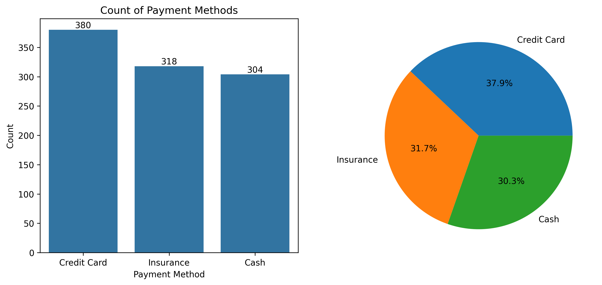
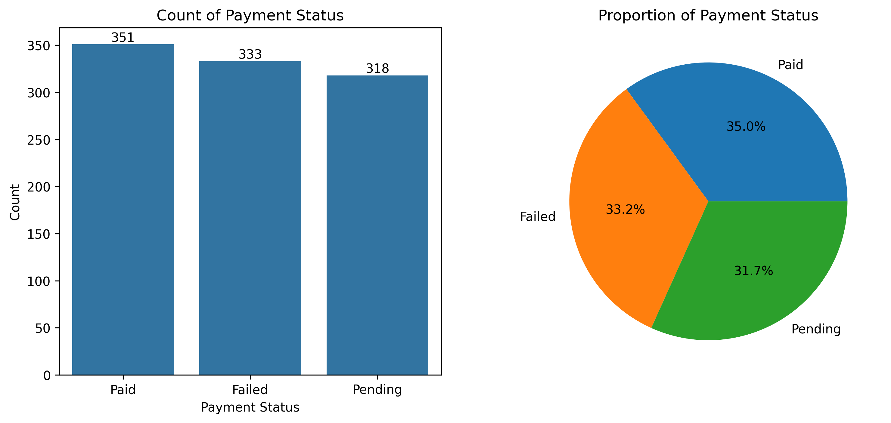
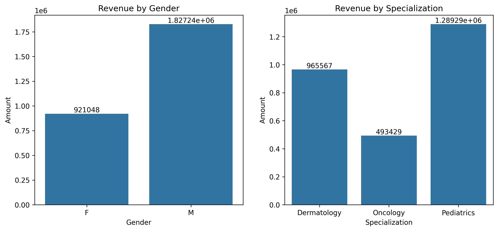

# Hospital_Revenue_Analysis-Python

## 1. Project Overview
The objective of this project is to leverage a simulated Hospital Management Dataset to gain critical insights into its operational efficiency, specifically targeting revenue generation and cost management. This initial phase focuses on understanding the financial landscape of the hospital, identifying key revenue streams, and pinpointing any discrepancies or inefficiencies that could impact profitability. The analysis utilizes various data manipulation, aggregation, and visualization techniques to present a clear picture of the hospital's financial performance.

## 2. Data Source
https://www.kaggle.com/datasets/kanakbaghel/hospital-management-dataset

## 3. Data Understanding and Preparation
The datasets used for this analysis is a Hospital Management Dataset sourced from Kaggle which have 5 csv files, those are:
**1. appointments.csv** : Patient appointment details.
**2. billing.csv** : Financial transaction records.
**3. doctors.csv** : Doctor demographic and specialization information.
**4. patients.csv** : Patient demographic data.
**5. treatments.csv** : Details regarding medical treatments provided.

**Initial Data Inspection:**
Each dataset was inspected for its structure, data types, and potential missing values or duplicates using `.info()`, `.head()`, `.describe()`, and `.isnull().sum()`. It was confirmed that the raw datasets were clean, with no significant missing values or duplicate entries requiring extensive pre-processing.

**Data Cleaning and Transformation:**
* The `appointment_date` column in appointments dataset, `bill_date` column in the `billing` dataset, `date_of_birth`,`registration_date` from pateints dataset, `treatment_date` column from treatments datset was successfully converted to a `datetime` object to facilitate time-series analysis.
* The `first_name` and `last_name` columns are combined and created a column named `doctor_name` in the `doctors` DataFrame and the columns `specialization`, `phone_number`, `years_experience`, `hospital_branch` were renamed to `dr_specialization`, `dr_phone_number`, `dr_years_experience`, `dr_hospital_branch` for clarity during merging to avoid conflicts with patient contact details and `first_name` and `last_name` columns were deleted.
* The `first_name` and `last_name` columns are combined and created a column named `patient_name` in the `doctors` DataFrame for clarity during merging to avoid conflicts during merging.

**Data Merging Strategy:**
* To enable a comprehensive analysis, all five datasets were systematically merged into a single DataFrame, named `merged_df`. This consolidation was crucial to link financial records (`billing`, `treatments`) with patient demographics (`patients`), doctor specializations (`doctors`), and appointment details (`appointments`).
* The merging was performed using appropriate common identifiers (e.g., `patient_id`, `doctor_id`, `appointment_id`, `treatment_id`) to ensure accurate data integration.
* A new dataset `df` created will all the required columns `appointment_id`, `appointment_date`, `appointment_time`, `gender`, `registration_date`, `patient_name`, `doctor_name`, `dr_specialization`, `dr_hospital_branch`, `treatment_type`, `cost`, `treatment_date`, `bill_date`, `amount`, `payment_method`, `payment_status`.
* The resulting `df` DataFrame provides a unified view for holistic analysis.

## 4. Exploratory Data Analysis (EDA) & Revenue Insights

### 4.1. Distribution of Billing Amount and Treatment Cost

An initial examination of the `amount` (billing) and `cost` (treatment) distributions provided a foundational understanding of the financial transactions.

* **Billing Amount:**
    * Min: 534.03
    * Max: 4973.63
    * Mean: 2742.80
    * Std Dev: 1280.62
* **Treatment Cost:**
    * Min: 534.03
    * Max: 4973.63
    * Mean: 2742.80
    * Std Dev: 1280.62
 
The distributions (as shown in the histograms) reveal the typical range of transactions and highlight any extreme values.

  
### 4.2. Payment Methods and Statuses

Understanding how payments are made and their current status is vital for revenue collection optimization.

* **Payment Methods:** The payment methods `Credit Card` **37.9%**, `Insurance` **31.7%** and `Cash` **30.3%**, indicating the channels for revenue inflow.
    
  
* **Payment Statuses:** A significant proportion of payments were `Paid` **35%**, but a notable percentage were `Pending` **31.7%** and `Failed` **33.2%** . This highlights potential challenges in the collection process that warrant further investigation.
    
  

### 4.3. Revenue by Patient Gender

Analysis of total revenue categorized by patient gender are Male **1827242.30** and Female **921047.86**

### 4.4. Revenue by Doctor Specialization

Investigating revenue generation across different doctor specializations helps identify high-value medical services and specialist contributions.
* `Pediatrics` were identified as the highest revenue-generating specializations. This suggests that the hospital's focus or investment in these areas is yielding significant financial returns.

### 4.5. Revenue by Doctor

Investigating revenue generation across different doctor helps identify high-value medical services and specialist contributions.
* `Sarah Taylor`, `Alex Davis`, `David Taylor` were identified as the highest revenue-generating doctors.

### 4.6. Revenue by Treatment Type

A detailed breakdown of revenue by `treatment_type` provides insights into the profitability and demand for specific services.
* `Chemotherapy`, `X-Ray` and `MRI` have the leading revenue contributon.
* Further analysis might be needed for treatment types showing high standard deviation in billing amounts, indicating potential discrepancies in pricing or service complexity (as explored in previous discussions).

## 5. Key Findings

* **Dominant Revenue Streams:** `Pediatrics` is the primary revenue drivers.
* **Payment Collection Challenges:** A significant portion of payments remain 'Pending' or 'Failed', indicating a need to refine the billing and collection processes.
* **Balanced Gender Contribution:** Noticed significant difference in contribution, with male patients generating $1,827,242.30 in revenue, notably higher than the $921,047.86 contributed by female patients. This indicates a substantial imbalance in revenue contribution between genders.
* **Doctor Performance:** Top-performing doctors by revenue are identifiable, allowing for performance incentives or resource allocation.
  
## 6. Recommendations

Based on the analysis, the following recommendations are proposed to optimize revenue and enhance financial management:

1.  **Streamline Payment Collection:** Implement a more robust follow-up system for 'Pending' and 'Failed' invoices to reduce outstanding balances. Analyze the reasons behind these statuses.
2.  **Strategic Investment:** Continue to invest in high-revenue specializations (e.g., Pediatrics) by ensuring adequate resources and doctor availability.
3.  **Monitor Top Performers:** Analyze the practices of high-revenue generating doctors to identify best practices that could be scaled or shared.
4.  **Cost-Benefit Analysis:** (Future) Integrate detailed cost data to perform profit margin analysis per treatment type and specialization, guiding more informed resource allocation decisions.

## 7. Conclusion

This initial analysis successfully illuminates hospital financial operations, offering data-driven insights for Revenue and Cost Optimization. The findings provide a solid foundation for improving profitability and operational efficiency.

### Author - BB Siva Venkatesh

This project is part of my portfolio, showcasing the Python Data Analysis skills essential for data analyst roles. If you have any questions, feedback, or would like to collaborate, feel free to get in touch!

- **LinkedIn**: [Connect with me professionally](https://www.linkedin.com/in/siva-venkatesh/)

Thank you for your support, and I look forward to connecting with you!
